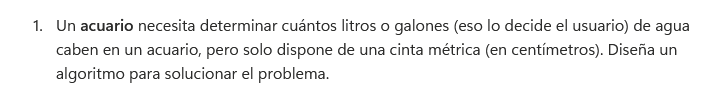
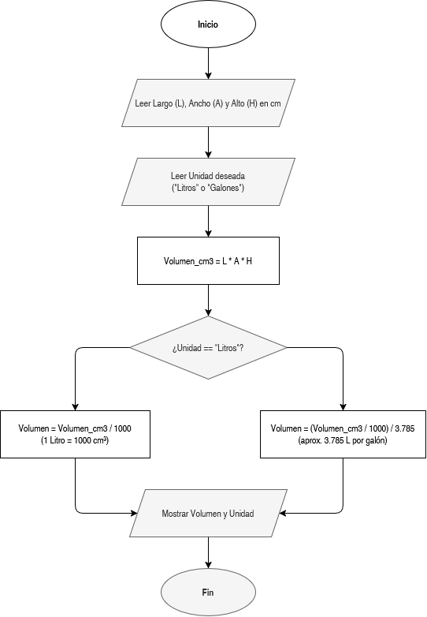

# Cálculo de Volumen para Acuario

En este ejercicio resolvemos un problema práctico: calcular la capacidad de agua de un acuario rectangular midiendo sus dimensiones en centímetros y permitiendo elegir entre litros o galones.

## Enunciado

> Un acuario necesita determinar cuántos litros o galones (eso lo decide el usuario) de agua caben en un acuario, pero solo dispone de una cinta métrica (en centímetros). Diseña un algoritmo para solucionar el problema.

## ¿Qué se hizo?

Se diseñó una secuencia lógica simple:
1. **Medición:** Se piden el largo, ancho y alto en centímetros.
2. **Preferencia:** Se pregunta si el resultado se requiere en litros o galones.
3. **Cálculo y conversión:** Se multiplican las medidas para obtener centímetros cúbicos y se convierten a la unidad seleccionada (dividiendo entre 1,000 para litros, y aplicando la conversión a galones si corresponde).
4. **Salida:** Se muestra el volumen final.
