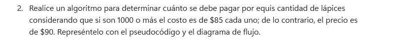
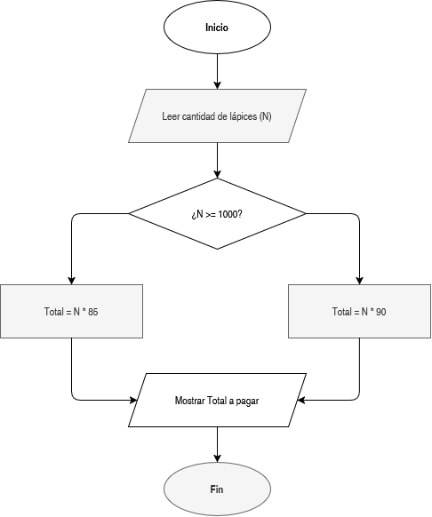

# Cálculo del Costo de Lápices por Volumen

En este ejercicio determinamos el costo total a pagar por la compra de una cantidad determinada de lápices, aplicando un descuento por escala de volumen.

## Enunciado

> Realice un algoritmo para determinar cuánto se debe pagar por equis cantidad de lápices considerando que si son 1000 o más el costo es de $85 cada uno; de lo contrario, el precio es de $90. Represéntelo con el pseudocódigo y el diagrama de flujo.

## ¿Qué se hizo?

Se estructuró una solución basada en una condicional simple:
1. **Lectura:** Se solicita la cantidad de lápices que el usuario desea comprar.
2. **Evaluación de condición:** Se verifica si la cantidad es mayor o igual a 1,000 unidades.
   - Si **sí**, se calcula el total multiplicando la cantidad por $85.
   - Si **no**, se calcula multiplicando la cantidad por el precio base de $90.
3. **Salida:** Se despliega en pantalla el costo total a pagar.
