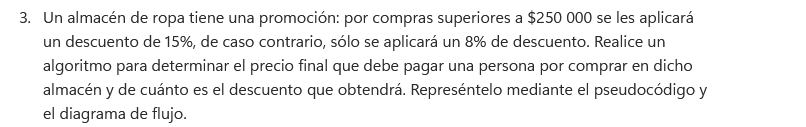
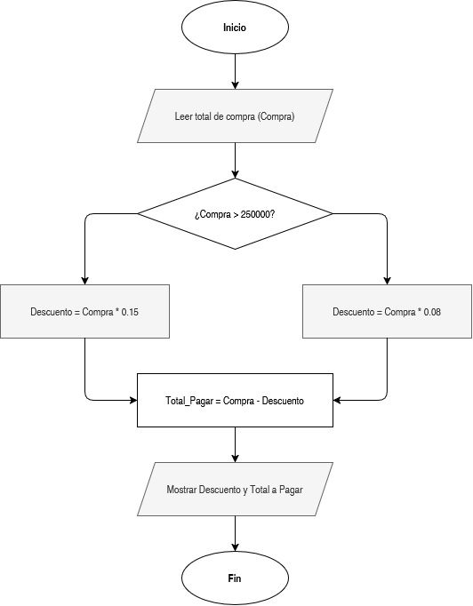

# Cálculo de Descuento y Precio Final en Almacén

En este ejercicio se calcula el monto del descuento aplicable a una compra de ropa y el valor neto final que el cliente debe pagar, dependiendo del umbral monetario alcanzado.

## Enunciado

> Un almacén de ropa tiene una promoción: por compras superiores a $250 000 se les aplicará un descuento de 15%, de caso contrario, sólo se aplicará un 8% de descuento. Realice un algoritmo para determinar el precio final que debe pagar una persona por comprar en dicho almacén y de cuánto es el descuento que obtendrá. Represéntelo mediante el pseudocódigo y el diagrama de flujo.

## ¿Qué se hizo?

Se desarrolló una estructura condicional para procesar la transacción:
1. **Lectura:** Se captura el monto total de la compra realizada.
2. **Evaluación:** Se valida si el monto supera los $250,000.
   - Si **sí**, se calcula un descuento del 15%.
   - Si **no**, se aplica un descuento del 8%.
3. **Cálculo final:** Se resta el valor del descuento al monto original para obtener el precio neto a pagar.
4. **Salida:** Se muestran ambos resultados en pantalla (el descuento obtenido y el total a pagar).
