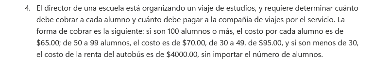
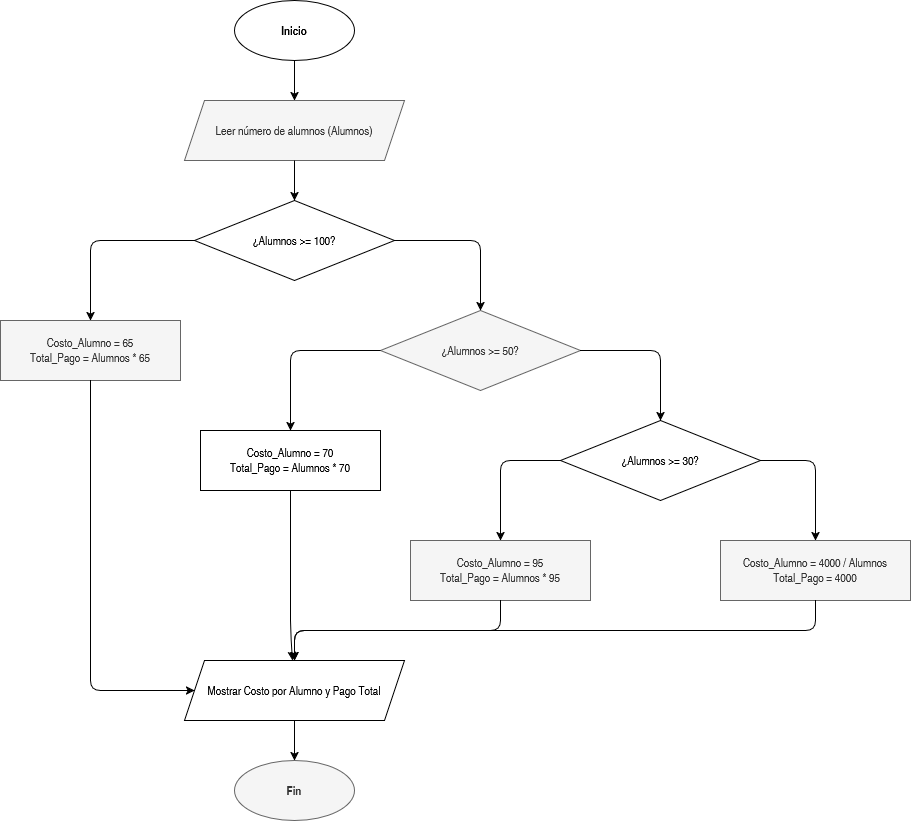

# Cálculo de Costos para Viaje de Estudios

En este ejercicio se determinan los cobros individuales por alumno y el costo global que la escuela debe pagar a la compañía de transporte, estructurado mediante rangos de escala de pasajeros.

# Enunciado y Diagrama de Fluijo 

## ¿Qué se hizo?

Se implementó una estructura de decisiones anidadas (escalonada):
1. **Lectura:** Se ingresa la cantidad total de alumnos inscritos para el viaje.
2. **Evaluación de rangos:**
   - Si son $\ge 100$ alumnos, el costo por alumno es de $65 y el pago total es $65 \times \text{Alumnos}$.
   - Si están entre $50$ y $99$, el costo por alumno es de $70 y el pago total es $70 \times \text{Alumnos}$.
   - Si están entre $30$ y $49$, el costo por alumno es de $95 y el pago total es $95 \times \text{Alumnos}$.
   - Si son $< 30$ alumnos, la renta fija del autobús es de $\$4000$, por lo que el costo unitario por alumno se calcula dividiendo $4000 / \text{Alumnos}$.
3. **Salida:** Se despliega el costo por alumno y el monto total a pagar a la compañía.
