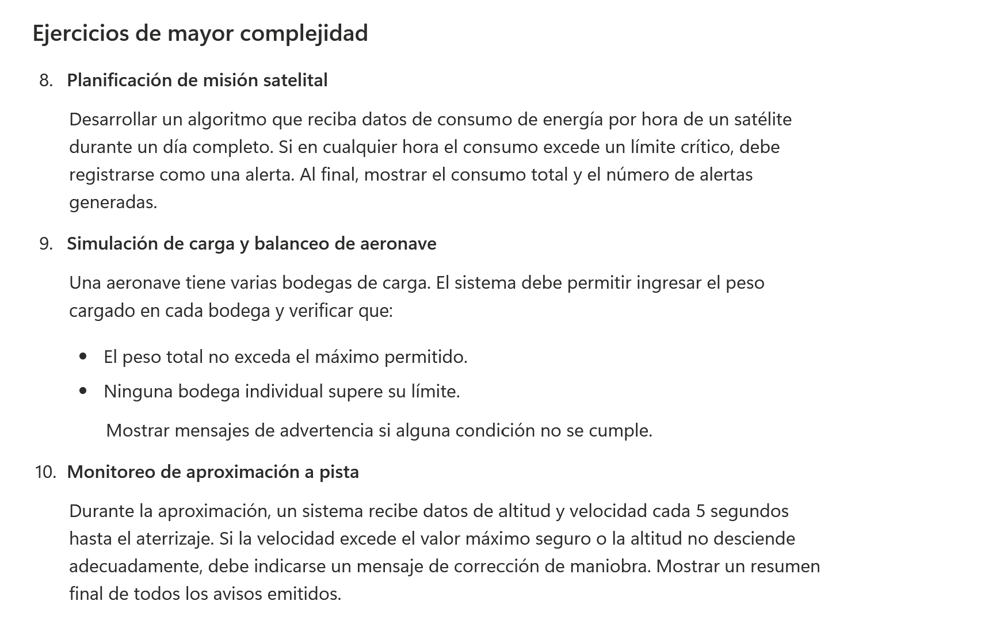
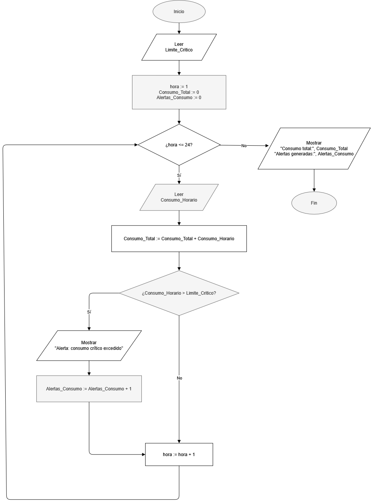
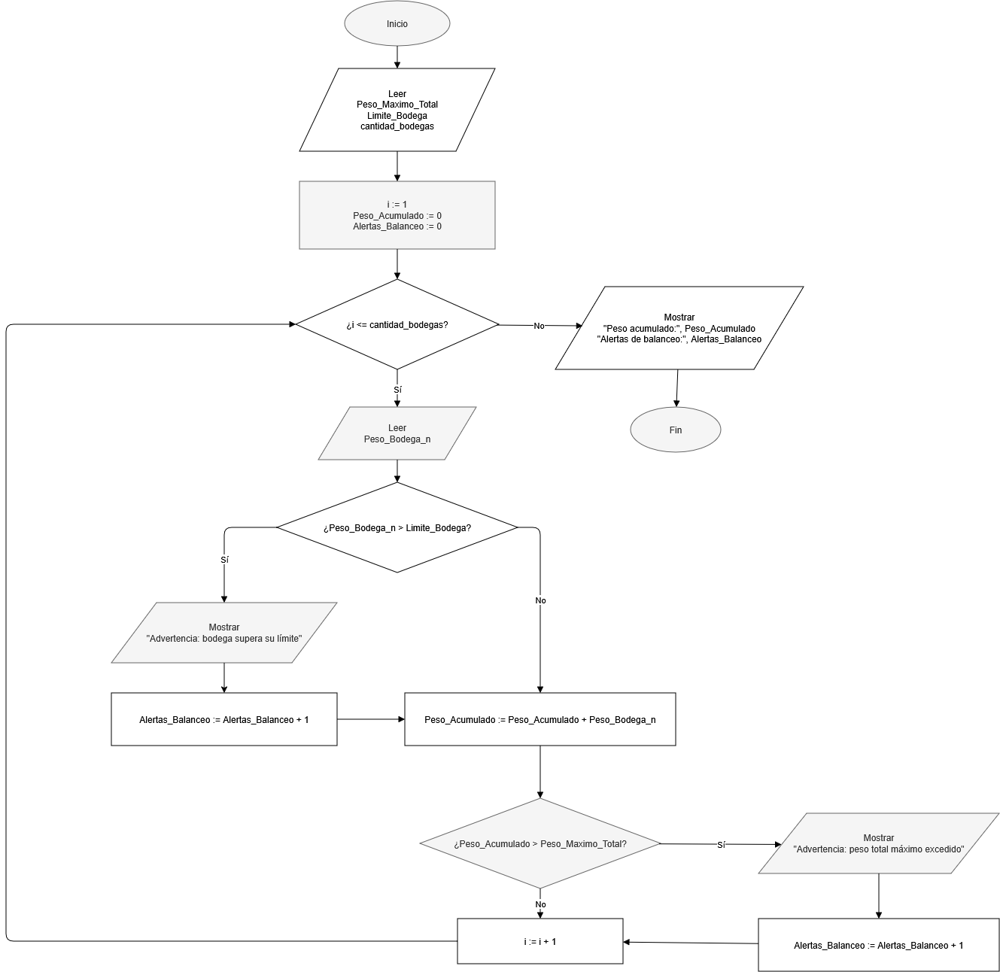
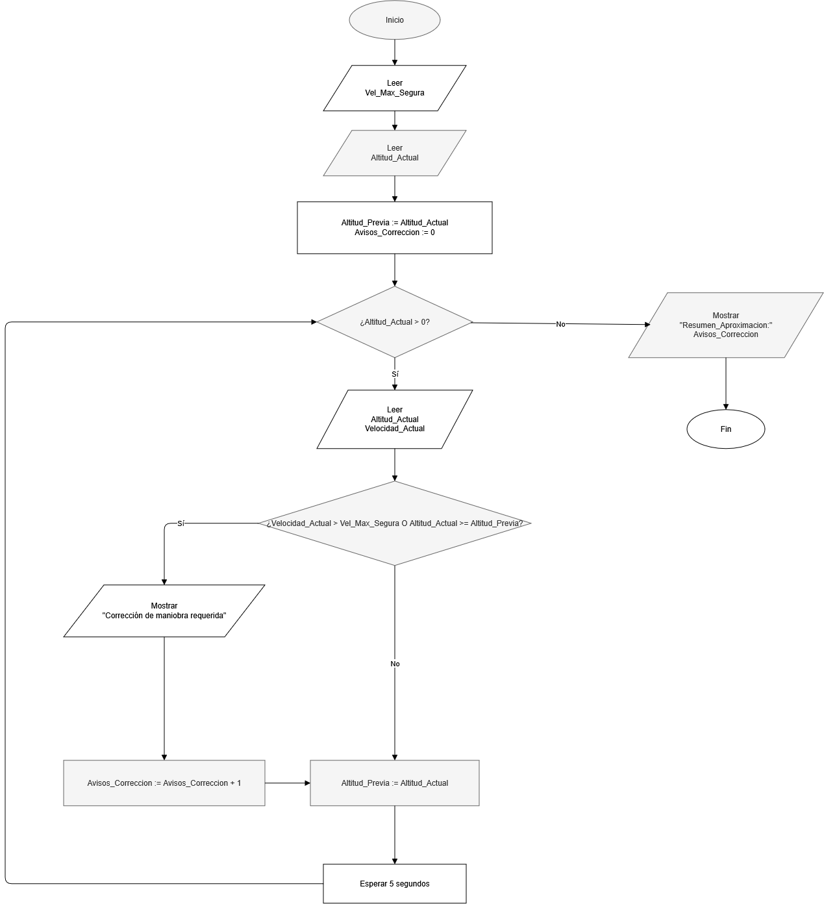

# Ejercicios 8, 9 y 10

## Enunciado

---

## Ejercicio 8
### Algoritmo
**1. Planteamiento del algoritmo:**

**2. Diagrama de Flujo (Pseudocódigo):**

---

## Ejercicio 9
### Algoritmo
**1. Planteamiento del algoritmo:**

**2. Diagrama de Flujo (Pseudocódigo):**

---

## Ejercicio 10
### Algoritmo
**1. Planteamiento del algoritmo:**

**2. Diagrama de Flujo (Pseudocódigo):**

